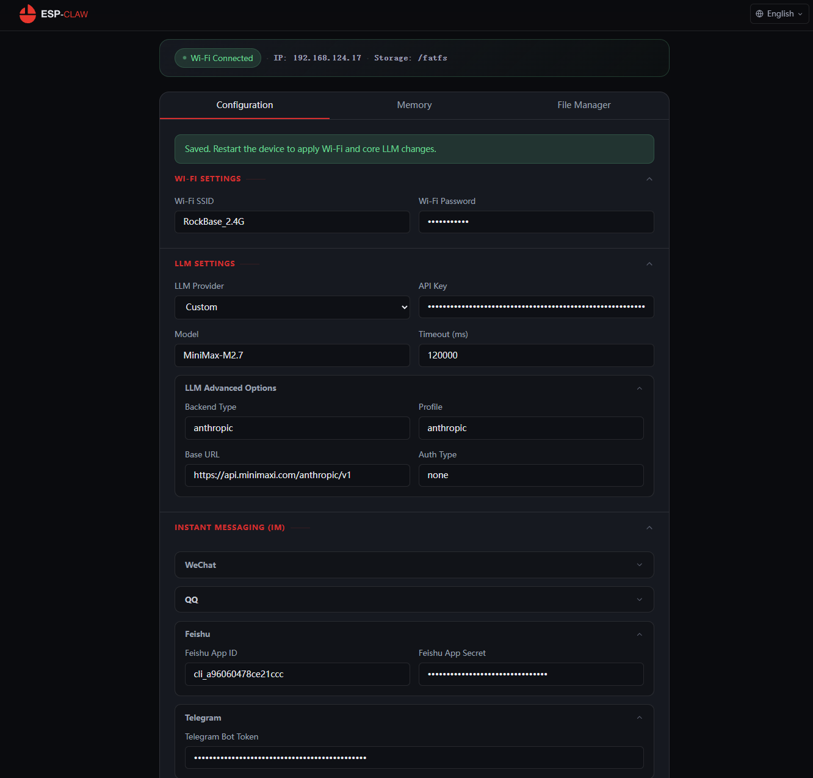
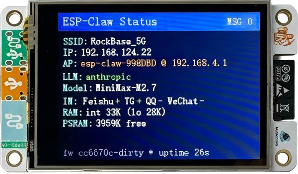
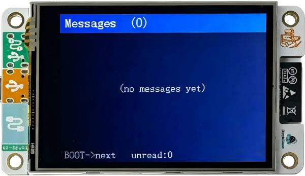
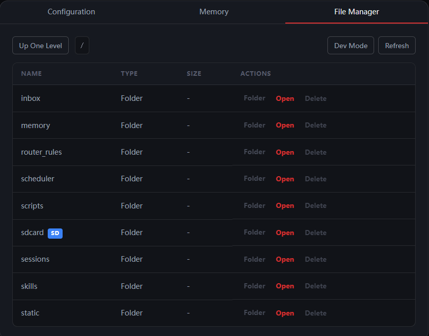

# NM-CYD-C5 board support

Pre-configured `esp_board_manager` files for the [NM-CYD-C5](https://github.com/RockBase-iot/NM-CYD-C5)
"Cheap Yellow Display" board built around an ESP32-C5-WROOM-1 module
(16 MB flash + 8 MB PSRAM, 2.8" 320×240 ST7789 LCD with XPT2046 resistive touch,
on-board WS2812 RGB LED, micro-SD slot and an LP-UART GPS connector).

## Pin map (from the official NM-CYD-C5 docs)

| Function | Pin(s) | Notes |
| --- | --- | --- |
| LCD (ST7789) | SCK=6, MISO=2, MOSI=7, CS=23, DC=24, BL=25 | RST tied to module RST |
| Touch (XPT2046) | shared SPI2, CS=1 | resistive touch screen |
| SD card slot | shared SPI2, CS=10 | MicroSD |
| WS2812 RGB LED | DIN=27 | single on-board pixel |
| GPS LP-UART (P5) | ESP32 RX=4, ESP32 TX=5 | NMEA @ 9600 baud (e.g. NM-ATGM336H) |
| I2C (CN1 header) | SDA=9, SCL=8 | 3V3 on pin 1 |
| Extension P1 | IO4, IO8, IO26 | |
| Extension FPC2 | IO2/IO6/IO7/IO10/IO4/IO8/IO5/IO9 + USB D±, GND | |

## What is registered with `esp_board_manager`

Devices (`board_devices.yaml`):

- **`display_lcd`** – ST7789 panel on SPI2 (CS=23, DC=24, RST=-1, BL=GPIO25).
  `setup_device.c` provides the `esp_lcd_new_panel_st7789` factory entry.
- **`led_strip`** – WS2812 RGB LED on GPIO27 (`init_skip: true` – the runtime
  driver is created on demand by `lua_module_led_strip`).
- **`fs_sdcard`** – SPI SD-card slot on CS=10 (`init_skip: true` – mount on
  demand to avoid SPI bus contention with the LCD when no card is inserted).
- **`lcd_touch`** – XPT2046 metadata entry (`type: custom`, `init_skip: true`);
  GPIO1 is reserved as the touch CS for user code that wants to drive the panel
  directly. The framework's Lua `lcd_touch` module currently only targets the
  I2C touch path, so no automatic Lua bridge is created.

Peripherals (`board_peripherals.yaml`):

- `i2c_master` (SDA=9 / SCL=8)
- `spi_display` (SPI2: MOSI=7 / MISO=2 / SCLK=6) – shared by LCD, touch and SD
- `ledc_backlight` (GPIO25, active HIGH)

WS2812 note:

- The RGB LED on GPIO27 is intentionally **not** pre-initialized as a board-manager
  RMT peripheral. It is created and released on demand by
  `/fatfs/scripts/builtin/nm_cyd_c5_rgb.lua` via `lua_module_led_strip`, which avoids
  RMT channel conflicts on ESP32-C5.

## Building

```powershell
cd application/basic_demo
idf.py set-target esp32c5
idf.py gen-bmgr-config -c ./boards -b nm_cyd_c5
idf.py build
idf.py -p <PORT> flash monitor
```

ESP-IDF v5.5.4 (or newer) is required for stable ESP32-C5 support.

| Offset | file|
|---|---|
|   0x2000 | bootloader.bin |
|   0x8000 | partition-table.bin |
|   0xf000 | ota_data_initial.bin |
|  0x20000 | basic_demo.bin |
| 0x820000 | emote_assets.bin |
| 0xb20000 | storage.bin |

## How to deploy and Use

You can flash the esp-claw version for NM-CYD-C5 from [NM Webflasher](https://flash.nmiot.net) before espressif support the NM-CYD-C5 board.

Choose the ESP Claw project, and choose the nm-cyd-c5 device.

## Basic-Demo User Guide

After you flashed the ESP Claw firmware, the ESP Claw on offline mode, you should use your phone or PC to connect the `Setup WiFi: esp-claw-XXXXXX`, then enter `192.168.4.1` from the browser.



As the picture show, you can config the WiFi Setting (At least), LLM Settings, INSTANT Messaging(IM) just as the normal OpenClaw Settings.

Then, you can save the parameters and restart the device.

### Status Screen

The Status Screen show the status of the ESP-Claw (NM-CYD-C5), press BOOT to the Message Box List, or back to the Main Screen.



### Message Box List

Show the incoming message from different IM channel. Press BOOT to Status Screen.



TF Card Support by the `File Manager`.


 [ x ] FAT32 4GB/8GB/16GB/32GB.
 [ x ] exFAT, NTFS not support.

TODO: 

 [ x ] Store the incoming message to SD card `/sdcard/inbox`.
 [ ] Help to improve the ESP-Claw memory.
 [ ] Known issues: when uploading a big file, test 50KB to SDCard, the device will reboot.


## Built-in Lua demos

The build syncs scripts from `application/basic_demo/main/lua_scripts/` into
`/fatfs/scripts/builtin/` on flash. Two NM-CYD-C5 specific demos ship with the
project:

- `nm_cyd_c5_rgb` – cycles the on-board WS2812 LED through a hue sweep.
- `nm_cyd_c5_gps` – opens UART2 on (RX=4, TX=5) @ 9600 baud, reads NMEA
  sentences for ~5 seconds and prints the parsed fix (latitude, longitude,
  satellites, time, altitude). Returns the parsed fix table when called via
  `dofile`, so other scripts / capabilities can pull the current location with
  one call.

Run them from chat / CLI with the `lua` capability, for example:

```text
run_lua_script script="nm_cyd_c5_gps"
```

Or from another script:

```lua
local gps = dofile("/fatfs/scripts/builtin/nm_cyd_c5_gps.lua")
if gps.valid then
    print(string.format("Got fix: %.6f, %.6f", gps.lat, gps.lon))
end
```

## To work with LLM

```text
# to work with ESP-Claw
show me your status
```

```text
# work with led
led rainbow 5s
set led to green blink 30s
...

```

```text
# work with screen

show me "xxxx" message on screen [center] [30]s
set screen backlight to 20%
backlight off/on

```

```text
# gps information
try to get gps information/status
```


## Connect to Other LLM

### For Kimi LLM Settings:

LLM Provider: Custom
API Key: ****
Model: kimi-k2.6
LLM Advanced Options: 
 - Backend Type: openai_compatible
 - Profile: openai
 - Base URL: https://api.moonshot.cn/v1
 - Auth Type: bearer

### For MiniMax LLM Settings:

LLM Provider: Custom
API Key: ****
Model: MiniMax-M2.7
LLM Advanced Options: 
 - Backend Type: anthropic
 - Profile: anthropic
 - Base URL: https://api.minimaxi.com/anthropic/v1
 - Auth Type: none

### NVIDIA free deepseek-v4-pro

LLM Provider: Custom
API Key: ****
Model: deepseek-ai/deepseek-v4-pro
LLM Advanced Options: 
 - Backend Type: openai_compatible
 - Profile: openai
 - Base URL: https://integrate.api.nvidia.com/v1
 - Auth Type: bearer

*Notes: nvidia API limit: HTTP 429: {"status":429,"title":"Too Many Requests"}*

### DeepSeek (edge_agent default choice)

LLM Provider: DeepSeek
API Key: ****
Model: deepseek-v4-pro
LLM Advanced Options: (do not need to change)
 - Backend Type: openai_compatible
 - Profile: custom_openai_compatible
 - Base URL: https://api.deepseek.com
 - Auth Type: bearer